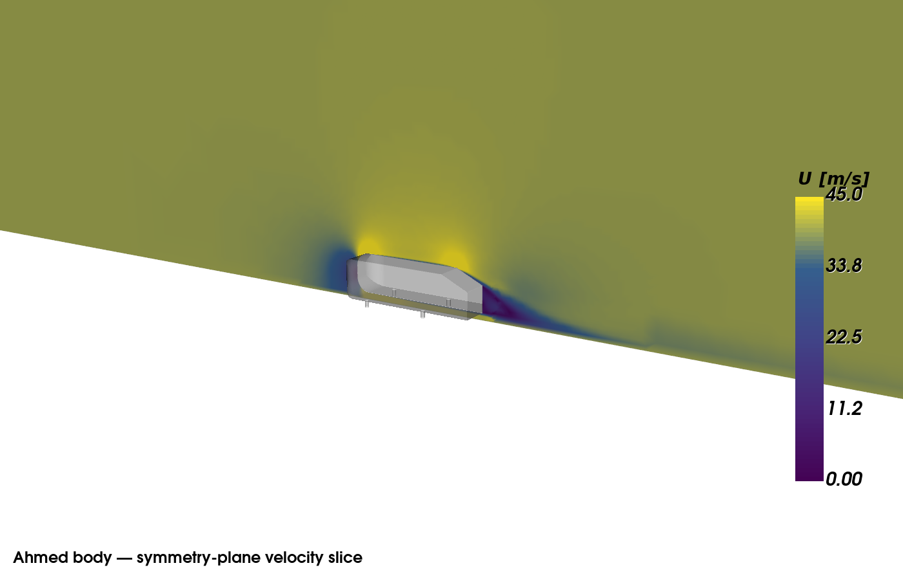
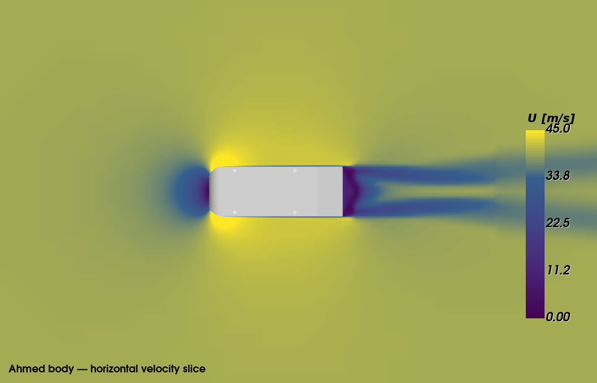

# Ahmed Body 25° — Steady RANS Validation

**[⬇ Download complete Ahmed Body OpenFOAM validation case](https://drive.google.com/file/d/1D6JRIJXeYbrt8wvAJRpOY3rBzG_ywE7a/view?usp=sharing)**

This case documents a steady RANS simulation of the 25° Ahmed body at 40 m/s using a mesh generated by HydroPro's automated 3D meshing technology.

## Case summary

| Item | Value |
|---|---|
| Geometry | Ahmed body, 25° rear slant |
| Freestream speed | 40 m/s |
| CFD solver | OpenFOAM `simpleFoam` |
| OpenFOAM version | 7 |
| Turbulence model | RANS, k-ω SST |
| Reference area | 0.115032 m² |
| Reference length | 0.470 m |
| Mesh cells | 2,082,880 |
| Mesh faces | 6,401,687 |
| Internal faces | 6,275,652 |
| Ahmed-body wall faces | 107,461 |
| Final iteration | 500 |

## Base validation case

The Ahmed-body solver setup used as the starting point for this validation was obtained from Nathan Rooy's public Ahmed Bluff Body CFD Validation repository:

https://github.com/nathanrooy/ahmed-bluff-body-cfd/tree/master/openfoam_rans

## CFD result

At iteration 500:

| Coefficient | Value |
|---|---:|
| Cm | 0.102888 |
| Cd | 0.292490 |
| Cl | 0.338394 |
| Cl(front) | 0.272085 |
| Cl(rear) | 0.066309 |

The reference drag coefficient used during validation was **Cd ≈ 0.299**, giving a difference of approximately **-2.18%**.

## Symmetry-plane velocity slice



This slice shows velocity magnitude on the symmetry plane and highlights the wake structure behind the body.

## Horizontal velocity slice



This horizontal cut illustrates the velocity field around the body and in the near wake.

## Inspecting the mesh

From the CFD case directory:

```bash
checkMesh
```

For visualization, create or open a `.foam` marker file and inspect the mesh and solution in ParaView.

## Running / restarting

The archive contains the completed validation state and may be used for mesh inspection, result review, or continuation. Users who want to reconstruct the original Ahmed-body starting setup can obtain it from the public source repository linked above.

## Reproducibility scope

This case is published to document the generated mesh and the resulting CFD validation.
