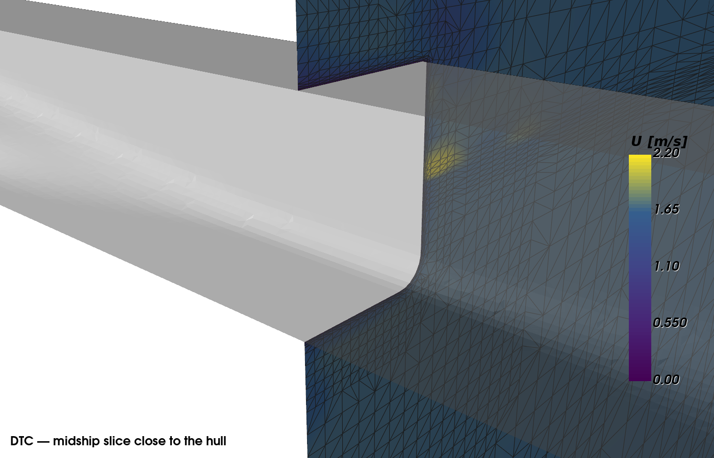
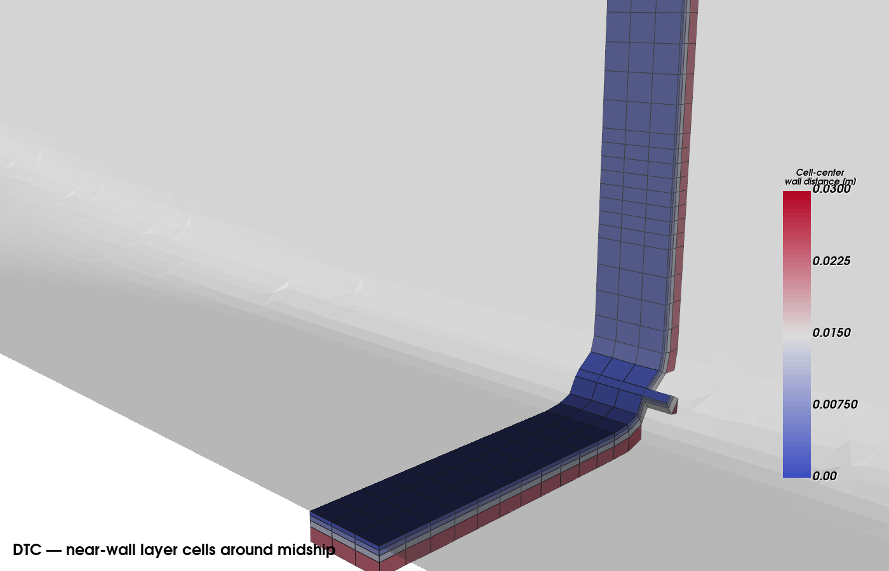

# Duisburg Test Case (DTC) — Free-Surface Resistance Validation

**[⬇ Download complete DTC OpenFOAM validation case](https://drive.google.com/file/d/1Cgaiaj46WVoRbSKlV5YIN5G0zRu3pDMk/view?usp=sharing)**

This case documents a free-surface resistance calculation on the Duisburg Test Case (DTC) hull using a mesh generated by HydroPro's automated 3D meshing technology.

## Case summary

| Item | Value |
|---|---|
| Geometry | Duisburg Test Case (DTC) |
| Domain | Half-domain with symmetry plane |
| Inflow speed | 1.668 m/s |
| CFD solver | OpenFOAM `interFoam` |
| OpenFOAM version | 5.x |
| Turbulence model | RANS, k-ω SST |
| Mesh cells | 278,418 |
| Mesh faces | 868,415 |
| Internal faces | 838,323 |
| Hull boundary faces | 10,819 |
| Final simulated time/step | 8000 |

## CFD result

Using the final 2,000 recorded force samples:

| Quantity | Mean |
|---|---:|
| Pressure resistance | 3.690 N |
| Viscous resistance | 12.419 N |
| Total resistance | 16.108 N |

The experimental total-resistance value used for comparison is **15.915 N for the half hull**. This gives a total-resistance difference of approximately **+1.21%**.

## Midship slice close to the hull



This figure shows a longitudinal midship cut close to the hull with velocity magnitude on the slice and the ship geometry overlaid.

## Near-wall layer cells



This view isolates near-wall cells around the midship region. Cells are colored by **cell-center to hull distance**, which gives a direct view of the wall-normal spacing distribution in the boundary-layer region.

## CFD setup source

The underlying DTC CFD setup is based on the DTC tutorial case distributed with OpenFOAM.

## Inspecting the mesh

From the CFD case directory:

```bash
checkMesh
```

For visualization, create or open a `.foam` marker file and inspect the mesh and solution in ParaView.

## Reproducibility scope

This case is published to document the generated mesh and the resulting CFD validation.
